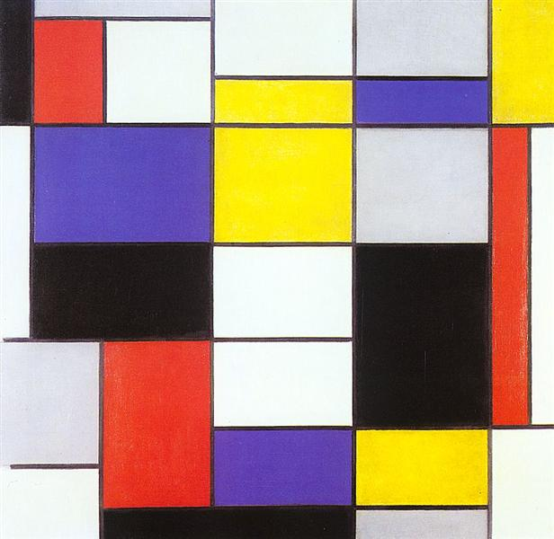
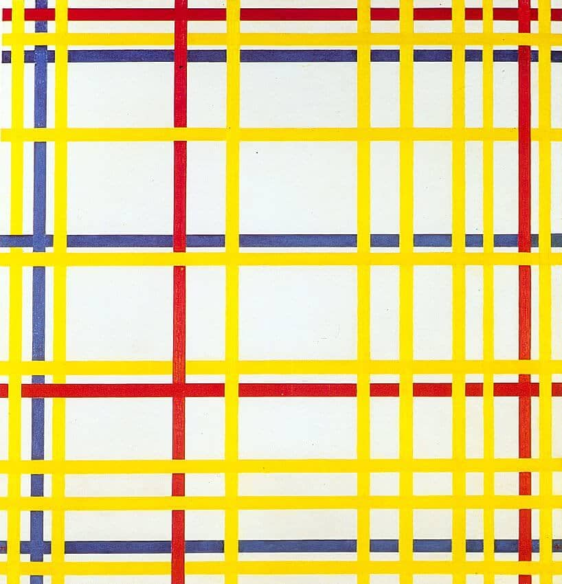
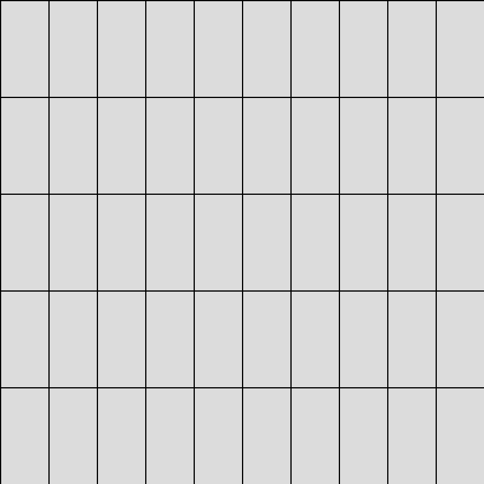

# qwan0810_9103_TUT1

## Quiz 8 : Design Research

### Part 1 : Imaging Technique Inspiration
Our group has not yet finalized the artwork for our final project, but I am particularly interested in Piet Mondrian’s Broadway Boogie Woogie. To explore a similar style, I looked at other works by Mondrian that use geometric shapes and primary colors to create structured and balanced compositions. The simplicity and clarity of this design style make it appealing for a project requiring clean and organized visuals.

#### 1. Mondrian’s Composition A (1923)
 

#### 2. Mondrian’s New York City I (1942)
 

### Part 2: Coding Technique Exploration
To achieve the geometric style of Composition A, I found a grid layout technique in p5.js. This technique allows for easy drawing of geometric shapes like rectangles and lines, which can be filled with primary colors, just like Mondrian's work. The p5.js grid function can help create a structured and balanced composition similar to Composition A by organizing shapes into a clean layout.

#### 1. Grid Layout 

#### 2. Link to p5.js grid layout code example
[Link to p5.js grid layout code example][def]

[def]: https://editor.p5js.org/Tiri/sketches/Sk_-uQu6